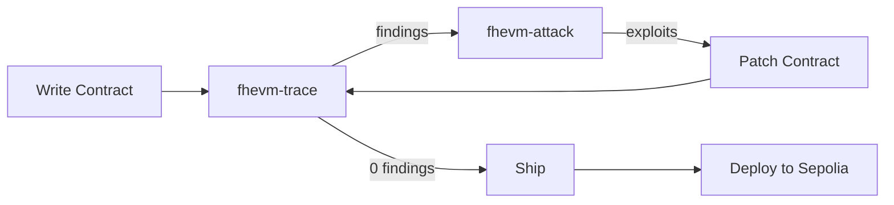

# fhevm-skill

An AI-agent skill that teaches coding agents how to write correct FHEVM smart contracts on the Zama Protocol. Includes a static ACL flow analyzer (`fhevm-trace`), a trace-directed dynamic attack generator (`fhevm-attack`), hardened reference contracts, a full confidential lending demo, and Sepolia deployment tooling.

## The closed loop



1. **Write** — Author a contract using `SKILL.md` guidance and reference templates
2. **Trace** — Run `fhevm-trace` to detect anti-patterns (AP-001 through AP-013) via AST + regex analysis
3. **Attack** — Run `fhevm-attack` to generate and execute exploit tests from trace findings
4. **Patch** — Fix flagged issues, re-trace until 0 findings
5. **Ship** — Compile, run happy-path tests
6. **Deploy** — Push to Sepolia with verification

## 30-second install

```bash
git clone <repo-url> && cd fhevm-skill
npm install
```

## Project structure

| Path | Description |
|------|-------------|
| `SKILL.md` | Core skill (1200+ lines) — mental model, types, ACL, anti-patterns, HCU, testing |
| `frontend/SKILL.md` | Frontend sub-skill — encryption, decryption, React+viem patterns |
| `references/` | Anti-patterns, ACL rules, HCU costs, cheatsheet |
| `tools/fhevm-trace/` | Static ACL flow analyzer — AST + regex, Mermaid graphs, trace.json |
| `tools/fhevm-attack/` | Trace-directed attack generator — template-based, dual-mode |
| `examples/confidential-lending-app/` | Full e2e demo: MockCUSDT + ConfidentialLending |
| `examples/.../contracts/broken/` | Intentionally buggy contracts for testing the closed loop |
| `examples/.../frontend/` | Vite + React + Tailwind + viem + relayer-sdk |
| `examples/.../scripts/` | Sepolia deploy + Etherscan verify scripts |
| `DEPLOYMENT.md` | Sepolia deployment guide with live contract addresses |

## Usage — closed loop demo

```bash
cd examples/confidential-lending-app

# 1. Compile
npx hardhat compile

# 2. Trace the broken contract (expect findings)
node ../../tools/fhevm-trace/src/index.js contracts/broken/ConfidentialLending.broken.sol
# -> 2 findings: AP-009, AP-011

# 3. Generate and run attacks
node ../../tools/fhevm-attack/src/index.js .
# -> 2 exploits succeeded

# 4. Trace the patched contract (expect 0 findings)
node ../../tools/fhevm-trace/src/index.js contracts/ConfidentialLending.sol contracts/MockCUSDT.sol
# -> 0 findings

# 5. Run happy-path tests
npx hardhat test test/happy-path.test.ts
```

## Sepolia deployment

See [DEPLOYMENT.md](DEPLOYMENT.md) for full instructions.

| Contract | Address | Etherscan |
|----------|---------|-----------|
| MockCUSDT | `0xb0740ACfea29B8ae9B4cc7103e540bde8CCE2439` | [View](https://sepolia.etherscan.io/address/0xb0740ACfea29B8ae9B4cc7103e540bde8CCE2439#code) |
| ConfidentialLending | `0x9aB9352cEFf6BF1375017122eEaD343bd12E2B90` | [View](https://sepolia.etherscan.io/address/0x9aB9352cEFf6BF1375017122eEaD343bd12E2B90#code) |

## Key technical details

- **FHE.* namespace** (v0.9+) — not the deprecated TFHE.* namespace
- **ZamaEthereumConfig** — not the removed SepoliaConfig
- **Self-relaying decryption** — `makePubliclyDecryptable` / `publicDecrypt` / `checkSignatures`
- **13 anti-patterns** documented with wrong/right code and detection methods
- **HCU awareness** — cost tables, loop danger zones, optimization strategies

## Future work

- Cross-contract trace (v2): follow imports one level, detect ACL leaks across contract boundaries
- Additional attack templates for AP-012 (overflow) and AP-013 (arbitrary execute)
- Mainnet deployment support
