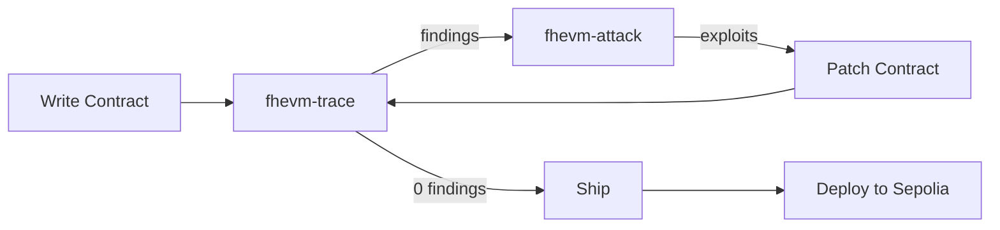

# fhevm-skill

**fhevm-skill** is a comprehensive AI agent skill for writing correct FHEVM smart contracts on Zama Protocol. Built as a [Zama Developer Program Mainnet Season 2](https://www.zama.org/post/zama-developer-program-mainnet-season-2-confidential-finance-is-the-next-frontier) bounty submission, it is optimized for Claude Code, Cursor, and Windsurf.

fhevm-skill provides a **closed feedback loop**: write contracts with SKILL.md guidance, statically analyze them with `fhevm-trace`, generate and run exploit tests with `fhevm-attack`, patch, and deploy. Every step is automated and machine-checkable.

## Core Components

| Component | Description |
|-----------|-------------|
| **[SKILL.md](SKILL.md)** | Primary deliverable — 1200+ line skill document covering mental model, encrypted types, ACL system, 13 anti-patterns, HCU budgets, testing, and decryption flows |
| **[frontend/SKILL.md](frontend/SKILL.md)** | Frontend sub-skill — 800+ lines on client-side encryption, `@zama-fhe/relayer-sdk`, EIP-712 `userDecrypt`, React+viem patterns |
| **[fhevm-trace](tools/fhevm-trace/)** | Static ACL flow analyzer — AST-based (`@solidity-parser/parser`) + regex fallback, outputs `trace.json` + Mermaid ACL graphs |
| **[fhevm-attack](tools/fhevm-attack/)** | Trace-directed dynamic attack generator — reads trace findings, instantiates exploit templates, runs them as Hardhat tests |
| **[Reference templates](templates/)** | Three hardened contract skeletons: ConfidentialAuction, ConfidentialLending, ConfidentialVote |
| **[Reference docs](references/)** | Anti-patterns, ACL rules, HCU cost tables, cheatsheet |
| **[Example app](examples/confidential-lending-app/)** | Full e2e confidential lending demo with frontend, Sepolia deployment, and broken variant for closed-loop testing |

## The Closed Loop



1. **Write** — Author a contract using `SKILL.md` guidance and reference templates
2. **Trace** — Run `fhevm-trace` to statically detect anti-patterns via AST + regex analysis
3. **Attack** — Run `fhevm-attack` to generate exploit tests from trace findings
4. **Patch** — Fix flagged issues, re-trace until 0 findings
5. **Ship** — Compile, run happy-path tests, verify all attacks blocked
6. **Deploy** — Push to Sepolia with Etherscan verification

## Quick Install — Load the Skill into Your AI Agent

Clone the repo and install dependencies:

```bash
git clone https://github.com/holybunnie/fhevm-skill.git && cd fhevm-skill
npm install
```

Then point your AI agent at the skill file:

- **Claude Code**: Open the repo folder. Claude Code automatically picks up `SKILL.md` from the workspace. You can also run `claude` from inside the repo directory.
- **Cursor**: Open the repo folder, then add `SKILL.md` to your project context via `@SKILL.md` in chat. For frontend work, also add `@frontend/SKILL.md`.
- **Windsurf**: Open the repo folder. Reference `SKILL.md` in your prompt or attach it as context.
- **Any LLM agent**: Paste the contents of `SKILL.md` into the system prompt or context window. For frontend work, also include `frontend/SKILL.md`.

That's it. The agent now knows how to write correct FHEVM contracts, use the ACL system, avoid all 13 anti-patterns, and run the closed-loop workflow.

## Use It — Prompt Your Agent with Natural Language

Once the skill is loaded, just ask your AI agent what you want to build. Here are real examples:

### Build a confidential lending app from scratch

> "Build me a confidential lending protocol on FHEVM. Users should be able to deposit encrypted collateral (euint64), borrow up to 50% LTV, and repay. Use MockCUSDT as the token. Make sure all balances are encrypted, ACL grants are correct, and no anti-patterns are present. Then run fhevm-trace on it to verify."

The agent will:
1. Scaffold a Hardhat project with `@fhevm/solidity` v0.9+ and `ZamaEthereumConfig`
2. Write the contracts using `FHE.select` instead of `if/else` on encrypted values (AP-001)
3. Add `FHE.allowThis` for persisted storage handles (AP-003) and `FHE.allow` for user-decryptable values (AP-004)
4. Use the returned transfer amount, not the requested amount (AP-009)
5. Run `fhevm-trace` to confirm 0 findings
6. Write tests that encrypt inputs, call the contract, decrypt results, and assert

### Build a sealed-bid auction

> "Create a confidential sealed-bid auction where bids are encrypted. The highest bidder wins but no one can see other bids. Use FHE.select for comparisons, add overflow guards, and schedule disclosure with a finality delay so the winner isn't revealed in the same block as the auction end."

### Add a frontend for an existing FHEVM contract

> "I have a ConfidentialLending contract deployed on Sepolia. Build me a React frontend with Vite and viem that encrypts deposit amounts client-side using @zama-fhe/relayer-sdk, and decrypts the user's balance using EIP-712 userDecrypt."

### Audit an existing contract

> "Run fhevm-trace on my contract at contracts/MyToken.sol. If it finds any anti-pattern violations, explain what's wrong and fix them. Then run fhevm-attack to confirm the fixes block all exploits."

### Run the closed-loop demo

```bash
cd examples/confidential-lending-app

# 1. Compile contracts
npx hardhat compile

# 2. Trace the broken contract (expect 2 findings: AP-009, AP-011)
node ../../tools/fhevm-trace/src/index.js contracts/broken/ConfidentialLending.broken.sol

# 3. Generate and run attacks against broken contract
node ../../tools/fhevm-attack/src/index.js .

# 4. Trace the patched contract (expect 0 findings)
node ../../tools/fhevm-trace/src/index.js contracts/ConfidentialLending.sol

# 5. Run happy-path tests
npx hardhat test test/happy-path.test.ts
```

## Key Coverage Areas

- **Encrypted types**: `ebool`, `euint8/16/32/64/128/256`, `eaddress`, `externalEuint*` — with `euint64` as default for balances
- **FHE operations**: Arithmetic, bitwise, comparison, selection, casting, randomness — all via `FHE.*` namespace (v0.9+)
- **Access control (ACL)**: `FHE.allow`, `FHE.allowThis`, `FHE.allowTransient`, `FHE.makePubliclyDecryptable`, `FHE.isSenderAllowed`
- **Encrypted inputs**: `externalEuint64` + `FHE.fromExternal(input, proof)` with proof binding to `msg.sender`
- **Decryption**: Self-relaying v0.9 model — `makePubliclyDecryptable` / `publicDecrypt` / `userDecrypt` / `checkSignatures`
- **13 anti-patterns** (AP-001 through AP-013): Each with rule statement, wrong/right code, and detection method
- **HCU budget awareness**: Cost tables per operation, loop danger zones, per-tx limits
- **Testing patterns**: `hre.fhevm.createEncryptedInput` + `assertCoprocessorInitialized` + encrypt/call/decrypt/assert cycle

## fhevm-trace — Static Analyzer

Parses Solidity files using `@solidity-parser/parser` and detects:

| Rule | Detection |
|------|-----------|
| AP-006 | Persistent ACL grant to external address (not `msg.sender`/`address(this)`) |
| AP-006-EXT | Cross-contract ACL leak — follows imports one level deep to detect the OpenZeppelin guide's flagship vulnerability |
| AP-009 | External call return value ignored in FHE comparison (silent failure) |
| AP-010 | Callback without `delete` before external call (replay vulnerability) |
| AP-011 | `makePubliclyDecryptable` in same function as timestamp check (premature disclosure) |

Outputs `trace.json` (machine-readable, consumed by `fhevm-attack`) and `trace.md` (Mermaid ACL flow graphs + findings).

## fhevm-attack — Attack Generator

Reads `trace.json` and instantiates exploit templates for each finding:

| Template | Exploit |
|----------|---------|
| `silent-failure-bid` | Submits encrypted bid with zero balance, asserts attacker becomes highest bidder |
| `acl-leak-via-proxy` | Deploys malicious proxy to extract ACL access through persistent allowance |
| `callback-replay` | Replays relayer callback calldata for double-drain |
| `reorg-disclosure` | Uses `evm_snapshot`/`evm_revert` to retain disclosed secrets across reorg |
| `hcu-budget` | Measures gas with increasing input sizes to detect HCU boundary failures |

**Dual mode**: Default asserts exploits succeed (confirms bugs). `EXPECT_BLOCKED=1` asserts exploits are blocked (confirms patches).

## Example: Confidential Lending App

A complete lending protocol demonstrating all FHEVM patterns:

- **MockCUSDT**: Confidential ERC20 with encrypted balances; transfer silently zeros on insufficient balance
- **ConfidentialLending**: Deposit collateral, borrow up to 50% LTV, repay — all with `FHE.select` (no branching on encrypted), proper ACL grants, overflow guards
- **Broken variant**: Same contract with 2 surgical bugs (AP-009 + AP-011) for demonstrating the closed loop
- **Frontend**: Vite + React + Tailwind + viem + `@zama-fhe/relayer-sdk` — wallet connect, mint, deposit, withdraw, borrow, repay, encrypted balance decryption via EIP-712 `userDecrypt`

## Sepolia Deployment

Both contracts are deployed and verified on Sepolia. See [DEPLOYMENT.md](DEPLOYMENT.md) for full instructions.

| Contract | Address | Etherscan |
|----------|---------|-----------|
| MockCUSDT | `0x8D6ADb0C749bf59252709B3edd5772780e1C3Ec0` | [View](https://sepolia.etherscan.io/address/0x8D6ADb0C749bf59252709B3edd5772780e1C3Ec0#code) |
| ConfidentialLending | `0xAA836099a011e5a15e46898B2C7A1999a2aec3Bd` | [View](https://sepolia.etherscan.io/address/0xAA836099a011e5a15e46898B2C7A1999a2aec3Bd#code) |

## Technical Details

- Uses `FHE.*` namespace (v0.9+) exclusively — not the deprecated `TFHE.*`
- Inherits `ZamaEthereumConfig` — not the removed `SepoliaConfig`
- Self-relaying decryption only — no v0.8 oracle callbacks
- `@fhevm/solidity` v0.9+, `@fhevm/hardhat-plugin` v0.3.0-1+, `@zama-fhe/relayer-sdk` v0.3.0-5+
- Solidity `^0.8.24`, ethers v6, Hardhat v2

## Project Structure

```
fhevm-skill/
  SKILL.md                              # Core skill (1233 lines)
  frontend/SKILL.md                     # Frontend sub-skill (818 lines)
  references/
    anti-patterns.md                    # 13 anti-patterns with detection
    acl-rules.md                        # ACL primitives reference
    hcu-costs.md                        # HCU cost tables
    cheatsheet.md                       # Quick reference
  tools/
    fhevm-trace/                        # Static ACL flow analyzer
      src/parser.js                     # AST walker (@solidity-parser/parser)
      src/rules.js                      # Rule detectors (AST + regex + cross-contract)
      src/graph.js                      # Mermaid graph emitter
      src/report.js                     # trace.json + trace.md builder
    fhevm-attack/                       # Trace-directed attack generator
      src/selector.js                   # Maps findings to templates
      src/instantiate.js                # Template substitution
      src/runner.js                     # Hardhat test executor
      templates/                        # 5 attack templates
  templates/                            # 3 hardened reference contracts
  examples/
    confidential-lending-app/
      contracts/                        # MockCUSDT + ConfidentialLending
      contracts/broken/                 # Intentionally buggy variant
      test/                             # Happy-path + attack tests
      frontend/                         # Vite + React + Tailwind + viem
      scripts/                          # Deploy + verify scripts
  DEPLOYMENT.md                         # Sepolia addresses + Etherscan links
  SUBMISSION.md                         # Community post
```
