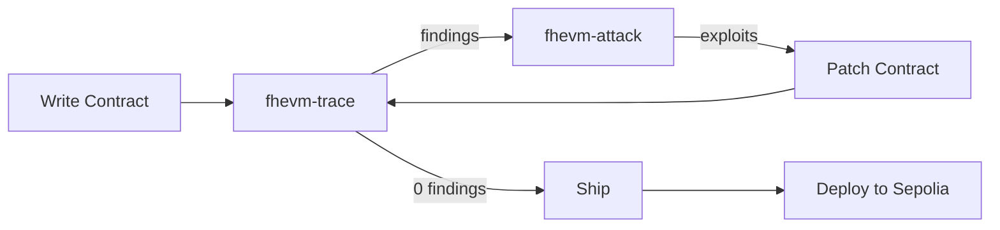

# fhevm-skill: Teaching AI Agents to Write Correct FHEVM Smart Contracts

## TL;DR

An AI-agent skill with a closed-loop workflow: **write, trace, attack, patch, ship, deploy**. Includes a 1200-line skill document, static analyzer, attack generator, hardened reference contracts, a full confidential lending demo, and live Sepolia deployment.

---

## Table of Contents

1. [Motivation](#motivation)
2. [What is fhevm-skill?](#what-is-fhevm-skill)
3. [The Closed Loop](#the-closed-loop)
4. [Architecture](#architecture)
5. [SKILL.md — The Core Deliverable](#skillmd--the-core-deliverable)
6. [fhevm-trace — Static ACL Flow Analyzer](#fhevm-trace--static-acl-flow-analyzer)
7. [fhevm-attack — Trace-Directed Attack Generator](#fhevm-attack--trace-directed-attack-generator)
8. [Example: Confidential Lending App](#example-confidential-lending-app)
9. [Sepolia Deployment](#sepolia-deployment)
10. [Frontend Integration](#frontend-integration)
11. [Results](#results)
12. [Future Work](#future-work)
13. [Links](#links)

---

## Motivation

FHEVM smart contracts are fundamentally different from standard Solidity. Encrypted data requires per-handle ACL management, branching on ciphertext is forbidden, arithmetic wraps silently, and decryption is asynchronous. AI coding agents (Copilot, Claude, Cursor) have no training data for these patterns and consistently produce broken FHEVM code.

This skill fills that gap. It gives any AI agent the knowledge to write correct FHEVM contracts — and the tools to verify correctness automatically.

## What is fhevm-skill?

A structured skill document (`SKILL.md`) plus companion tooling that an AI coding agent loads as context. The skill covers:

- The FHE mental model (why encrypted != plaintext)
- All encrypted types and operations in the `FHE.*` namespace (v0.9+)
- The ACL system (`allow`, `allowThis`, `allowTransient`, `makePubliclyDecryptable`)
- Encrypted input handling (`externalEuint64` + proof)
- Self-relaying decryption (`makePubliclyDecryptable` / `publicDecrypt` / `checkSignatures`)
- 13 anti-patterns (AP-001 through AP-013) with wrong/right code
- HCU budget awareness (cost tables, loop danger zones)
- Testing patterns (encrypt, call, decrypt, assert)
- Frontend integration (React + viem + `@zama-fhe/relayer-sdk`)

## The Closed Loop

The differentiator is a **closed feedback loop** that catches bugs before deployment:



1. **Write** — Agent authors a contract using SKILL.md patterns
2. **Trace** — `fhevm-trace` statically analyzes the Solidity AST for anti-patterns
3. **Attack** — `fhevm-attack` generates exploit tests from trace findings
4. **Patch** — Agent fixes flagged issues
5. **Loop** — Re-trace until 0 findings, re-attack with `EXPECT_BLOCKED=1` to confirm fixes
6. **Deploy** — Push to Sepolia with Etherscan verification

## Architecture

```
fhevm-skill/
  SKILL.md                    # Core skill (1200+ lines)
  frontend/SKILL.md           # Frontend sub-skill (770+ lines)
  references/
    anti-patterns.md          # 13 anti-patterns with detection
    acl-rules.md              # ACL primitives reference
    hcu-costs.md              # HCU cost table
    cheatsheet.md             # Quick reference
  tools/
    fhevm-trace/              # Static ACL flow analyzer
      src/parser.js           # AST walker (@solidity-parser/parser)
      src/rules.js            # Rule detectors (AST + regex)
      src/graph.js            # Mermaid graph emitter
      src/report.js           # trace.json + trace.md builder
    fhevm-attack/             # Trace-directed attack generator
      src/selector.js         # Maps findings to attack templates
      src/instantiate.js      # Template substitution
      src/runner.js           # Hardhat test executor
      templates/              # 5 attack templates
  examples/
    confidential-lending-app/
      contracts/              # MockCUSDT + ConfidentialLending (hardened)
      contracts/broken/       # Intentionally buggy version
      test/                   # Happy-path + attack tests
      frontend/               # Vite + React + Tailwind + viem
      scripts/                # Deploy + verify scripts
```

## SKILL.md — The Core Deliverable

The skill document is 1200+ lines organized into 16 sections. It uses only the current `FHE.*` namespace (v0.9+), `ZamaEthereumConfig`, and self-relaying decryption. All deprecated APIs (`TFHE.*`, `SepoliaConfig`, `requestDecryption`, oracle callbacks) are explicitly marked as removed.

Key sections:
- **Mental model**: Why encrypted state requires different thinking
- **ACL deep dive**: Per-handle access control, the most common bug source
- **13 anti-patterns**: Each with rule ID, wrong code, right code, and detection method
- **HCU budgets**: Cost tables per operation per type, loop analysis
- **Testing patterns**: The encrypt/call/decrypt/assert cycle
- **Templates**: Hardened contract skeletons ready to copy

## fhevm-trace — Static ACL Flow Analyzer

A Node.js CLI that parses Solidity files using `@solidity-parser/parser` and detects:

| Rule | What it detects |
|------|----------------|
| AP-006 | Persistent ACL grant to external address (not msg.sender/address(this)) |
| AP-009 | External call return value ignored (silent failure) |
| AP-010 | Callback without delete-before-transfer (replay) |
| AP-011 | `makePubliclyDecryptable` in same function as timestamp check (premature disclosure) |

Output: `trace.json` (machine-readable) + `trace.md` (Mermaid ACL flow graphs + findings).

Each finding includes a `suggested_attack` key that maps directly to an attack template.

## fhevm-attack — Trace-Directed Attack Generator

Reads `trace.json`, selects attack templates based on `suggested_attack`, instantiates them with finding-specific data, and runs them as Hardhat tests.

**Dual mode**:
- Default: asserts exploits succeed (confirms bugs)
- `EXPECT_BLOCKED=1`: asserts exploits are blocked (confirms patches)

Templates: `silent-failure-bid`, `acl-leak-via-proxy`, `callback-replay`, `reorg-disclosure`, `hcu-budget`.

## Example: Confidential Lending App

A complete lending protocol demonstrating all FHEVM patterns:

- **MockCUSDT**: Confidential ERC20 with encrypted balances. Transfer silently zeros on insufficient balance (AP-009 safe: returns actual amount).
- **ConfidentialLending**: Deposit collateral, borrow up to 50% LTV, repay. All operations use `FHE.select` (no branching on encrypted), proper ACL grants, overflow guards.
- **Broken variant**: Same contract with 2 surgical bugs (AP-009: ignored return, AP-011: premature disclosure) for testing the closed loop.

The closed loop produces:
- Broken contract: 2 findings, 2 exploits succeeded
- Patched contract: 0 findings, 0 attacks generated

## Sepolia Deployment

Both contracts are deployed and verified on Sepolia:

| Contract | Address | Etherscan |
|----------|---------|-----------|
| MockCUSDT | `0x8D6ADb0C749bf59252709B3edd5772780e1C3Ec0` | [Verified](https://sepolia.etherscan.io/address/0x8D6ADb0C749bf59252709B3edd5772780e1C3Ec0#code) |
| ConfidentialLending | `0xAA836099a011e5a15e46898B2C7A1999a2aec3Bd` | [Verified](https://sepolia.etherscan.io/address/0xAA836099a011e5a15e46898B2C7A1999a2aec3Bd#code) |

## Frontend Integration

A `frontend/SKILL.md` (770+ lines) covers:
- Client-side encryption with `@zama-fhe/relayer-sdk/web` (browser bundle with WASM + `initSDK()`)
- Two decryption paths: `publicDecrypt` and `userDecrypt` (EIP-712)
- `checkSignatures` for on-chain verification
- Common frontend bugs and fixes
- Complete React component example

The example frontend (Vite + React + Tailwind + viem) includes: wallet connect, mint cUSDT, deposit, withdraw, borrow, repay, encrypted balance decryption (EIP-712 `userDecrypt`), and network switching (Hardhat/Sepolia).

## Results

| Metric | Value |
|--------|-------|
| SKILL.md lines | 1200+ |
| Frontend SKILL.md lines | 770+ |
| Anti-patterns documented | 13 |
| Trace rules implemented | 5 (AST + regex + cross-contract) |
| Attack templates | 5 |
| Reference contracts | 3 (MockCUSDT, ConfidentialLending, broken variant) |
| Sepolia contracts deployed | 2 (both verified) |
| Closed-loop validated | Broken: 2 exploits, Patched: 0 findings |

## Cross-Contract Trace (AP-006-EXT)

The static analyzer follows Solidity `import` statements one level deep. When Contract A persistent-allows a handle to Contract B and calls `B.method(handle)`, and B does `FHE.allow(result, msg.sender)`, the tool flags this as AP-006-EXT — the OpenZeppelin FHEVM security guide's flagship cross-contract vulnerability.

An attacker proxy P calling `A.someEntry()` can route the handle through B, get the result allowed to P (since `msg.sender` inside B is A, and P controls A's entry point), and disclosure-leak encrypted data.

The fixture at `tools/fhevm-trace/test/fixtures/dirty-cross-contract-leak/` demonstrates this with two contracts (ContractA + HelperB).

## Future Work

- Additional attack templates for AP-012 (overflow) and AP-013 (arbitrary execute)
- Mainnet deployment support
- VS Code extension for inline trace warnings

## Links

- **Repository**: [GitHub link]
- **Demo video**: [YouTube link placeholder]
- **Deployed contracts**: See [DEPLOYMENT.md](DEPLOYMENT.md)
- **Zama docs**: https://docs.zama.ai/fhevm
